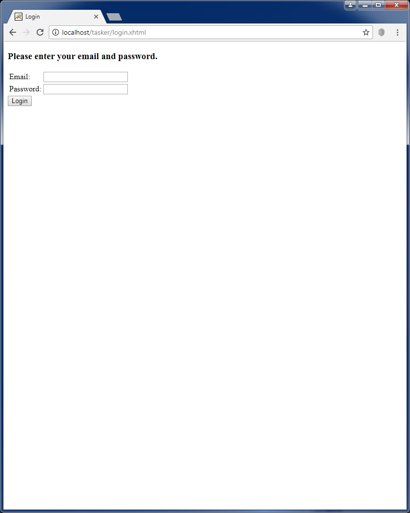
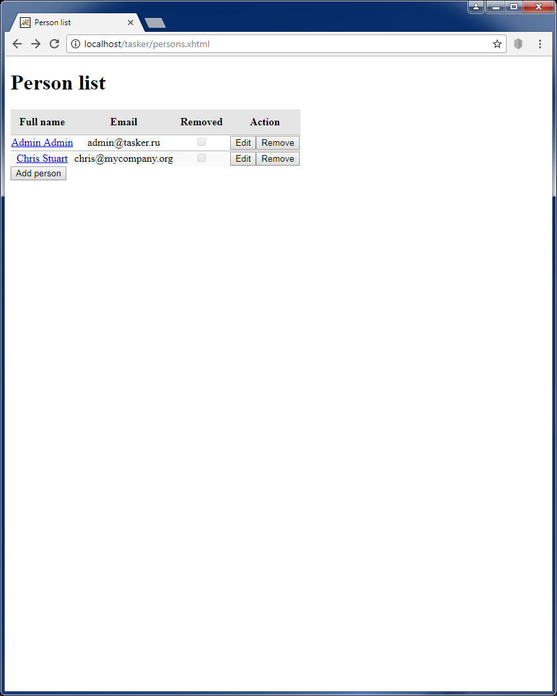
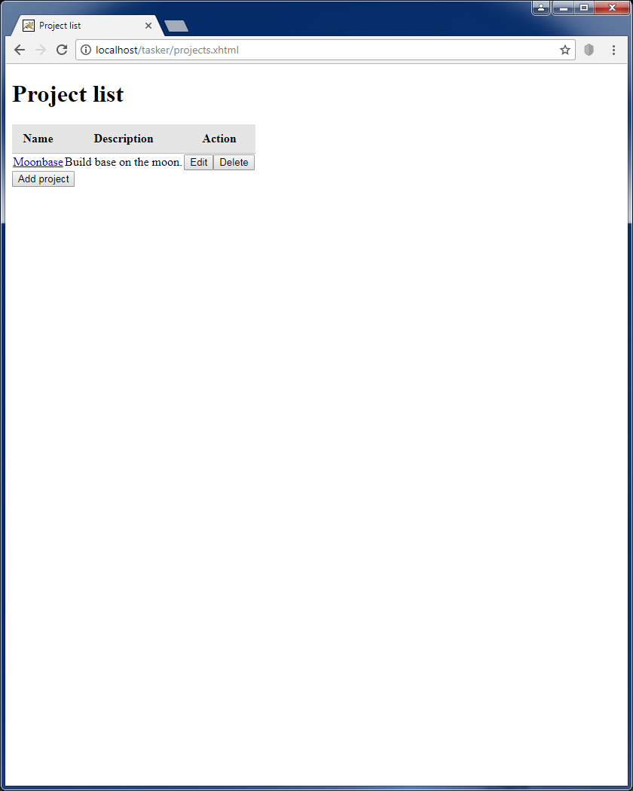
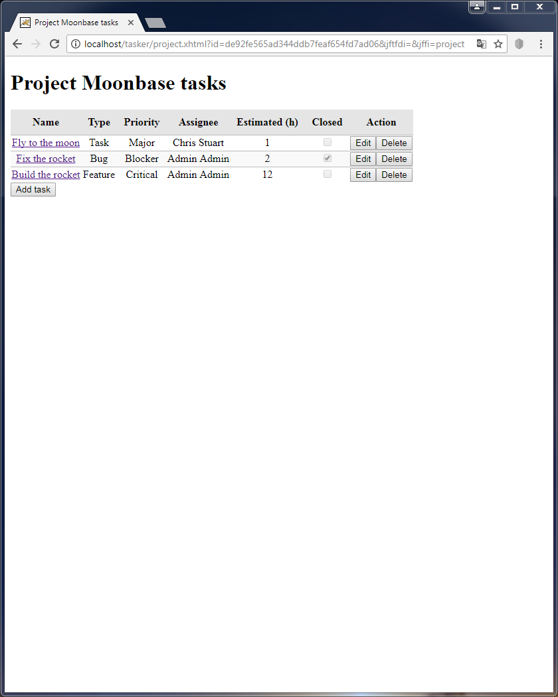
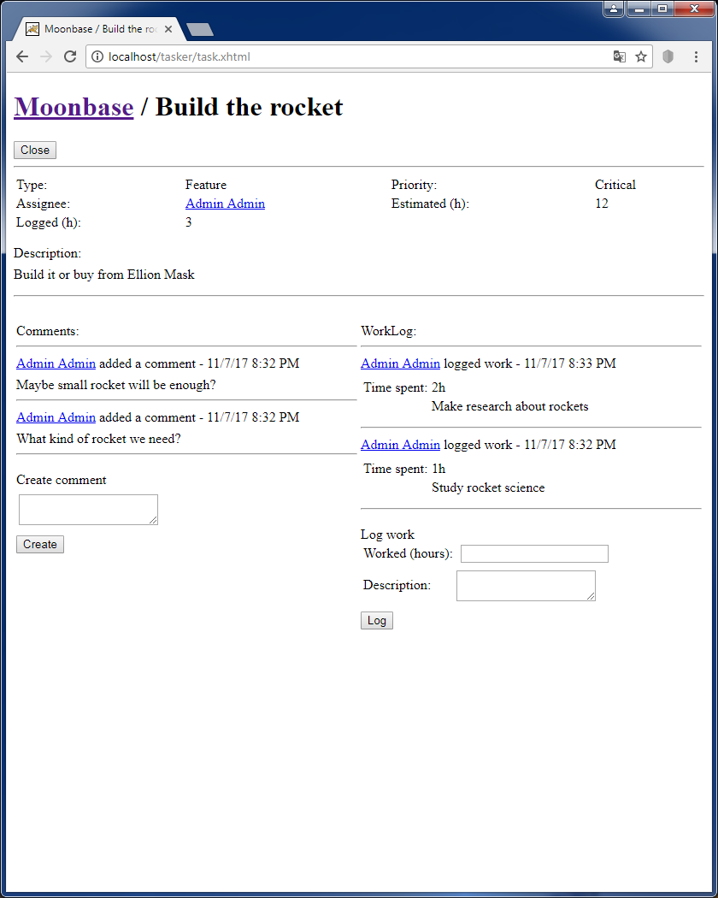
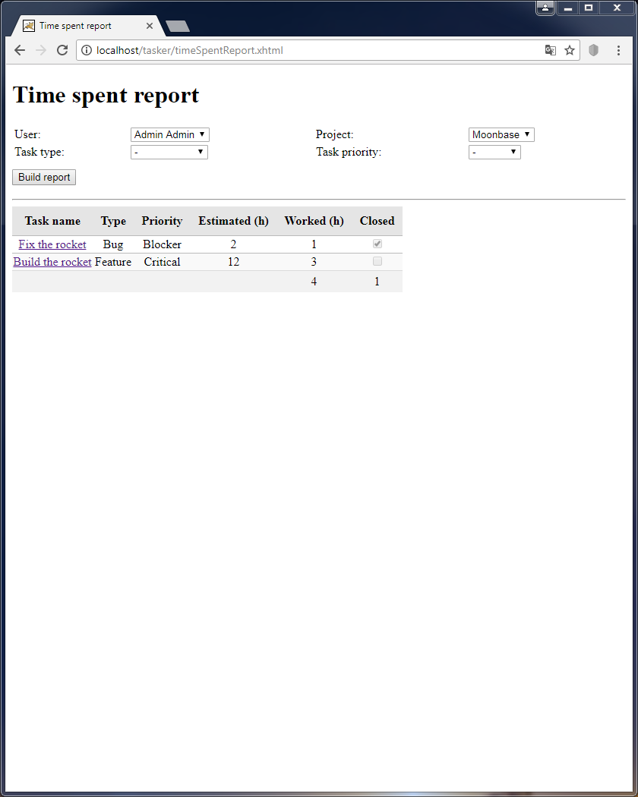

# Tasker

It's my ancient student project. I tried to develop simple project management system and make some experiments with:
* Java EE stack without heavy-weight technologies like EJB and application containers.
* JSF.
* CDI.
* Hibernate with native SQL queries (sometimes they are necessary for sufficient performance).
* Java Bean Validation.

## Features
* Create/edit/delete/view users.
* Create/edit/delete/view projects.
* Create/edit/delete/view tasks in project.
* Add comments to tasks.
* User can report about spent time on task.
* Build simple reports about spent time.

## How to run
1. Setup PostgreSql 9.
2. Create user with credentials "tasker"/"tasker" in it.
3. Create database "tasker" with owner "tasker".
    * By default application automatically create schema objects and destroy all data on each startup.
    * Alternatively you can disable hibernate "hbm2ddl.auto=create" and restore database backup manually from "db-backup" folder.
4. Build war and deploy it in Tomcat 7.
5. Enter you application with default user "admin@tasker.ru"/"admin@tasker.ru".

